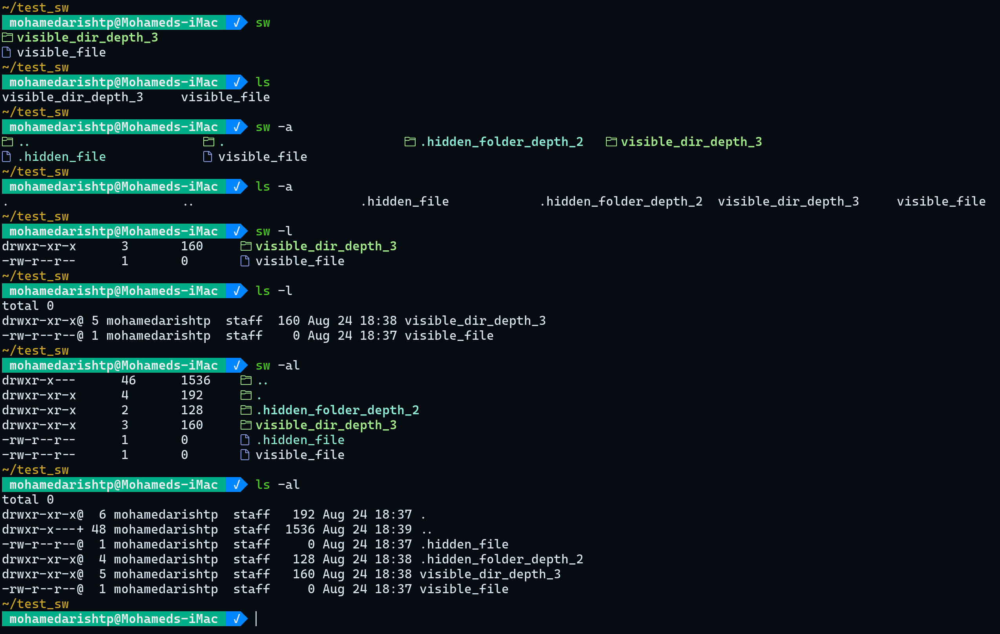

# sw

An ls clone made in rust with minimal features



## Requirements

- A [NerdFont](https://www.nerdfonts.com/) for displaying the icons (  &  )

If you can see these in your browser, then your browser uses a nerdfont as
default font

## Build Steps

To install this project and use it on your machine do as follows

- Clone this repo onto your machine

```sh
git clone https://www.github.com/mohamedarish/sw.git
```

- Install this repo using cargo
  - make sure you have [rust](https://www.rust-lang.org/tools/install) installed

```sh
cargo instal --path ./sw
```

- Add cargo binaries to your path
  - for bash

  ```sh
  echo "export PATH='$HOME/.cargo/bin:$PATH'" >> ~/.bashrc
  ```

  - for zsh

  ```sh
  echo "path+=$HOME/.cargo/bin" >> ~/.zshrc
  ```
